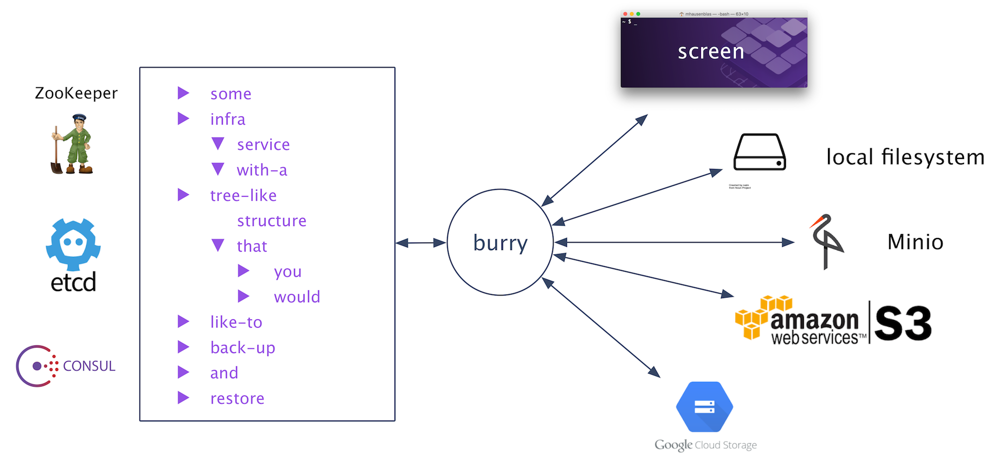

# burry

[](https://goreportcard.com/report/github.com/mhausenblas/burry.sh)

This is `burry`, the BackUp & RecoveRY tool for cloud native infrastructure services. Use `burry` to back up and restore
critical infrastructure base services such as ZooKeeper and etcd. [More…](https://hackernoon.com/backup-recovery-of-infrastructure-services-200b2116930f)



`burry` currently supports the following infra services and storage targets:

|                |ZooKeeper   |etcd    | Consul   |
| --------------:| ---------- | ------ | -------- |
| Amazon S3      | B/R        | B/R    | B/R      |
| Azure Storage  | []/[]      | []/[]  | []/[]    |
| Google Storage | B/R        | B/R    | B/R      |
| Local          | B/R        | B/R    | B/R      |
| Minio*         | B/R        | B/R    | B/R      |
| TTY**          | B/-        | B/-    | B/-      |

```
 B  ... backups supported
 R  ... restores supported
 -  ... not applicable
 [] ... not yet implemented
 *) Minio can be either on-premises or in the cloud, but always self-hosted. See also https://www.minio.io
**) TTY effectively means it's not stored at all but rather dumped on the screen; useful for debugging, though.
```

Note:

- `burry` is WIP, please use with care
- if you want to learn more about the design (goals/assumptions), check out the [background](background.md) notes
- if you want to hack (rather than simply use) `burry`, check out the [development and testing](dev.md) notes

**Contents:**

- [Install](#install)
- [Use](#use)
  - [Backups](#backups)
    - Example: [Screen dump of local ZooKeeper content](#screen-dump-of-local-zookeeper-content)
    - Example: [Back up etcd to local storage](#back-up-etcd-to-local-storage)
    - Example: [Back up DC/OS system ZooKeeper to Amazon S3](#back-up-dcos-system-zookeeper-to-amazon-s3)
    - Example: [Back up etcd to Minio](#back-up-etcd-to-minio)
  - [Restores](#restores)
    - Example: [Restore etcd from local storage](#restore-etcd-from-local-storage)
    - Example: [Restore Consul from Minio](#restore-consul-from-minio)
- [Release history](#release-history)
- [Background](background.md)
- [Development and testing](dev.md)

## Install

Currently, only 'build from source' install is available (note: replace `GOOS=linux` with your platform):

    $ go get github.com/mhausenblas/burry.sh
    $ GOOS=linux go build
    $ mv burry.sh burry
    $ godoc -http=":6060" &
    $ open http://localhost:6060/pkg/github.com/mhausenblas/burry.sh/

See also [GoDocs](https://godoc.org/github.com/mhausenblas/burry.sh).

## Use

The general usage is:

```bash
$ burry --help
Usage: burry [args]

Arguments:
  -b, --burryfest
        Create a burry manifest file .burryfest in the current directory.
        The manifest file captures the current command line parameters for re-use in subsequent operations.
  -c, --credentials string
        The credentials to use in format STORAGE_TARGET_ENDPOINT,KEY1=VAL1,...KEYn=VALn.
        Example: s3.amazonaws.com,ACCESS_KEY_ID=...,SECRET_ACCESS_KEY=...,BUCKET=...,PREFIX=...
  -e, --endpoint string
        The infra service HTTP API endpoint to use.
        Example: localhost:8181 for Exhibitor
  -i, --isvc string
        The type of infra service to back up or restore.
        Supported values are [etcd zk] (default "zk")
  -o, --operation string
        The operation to carry out.
        Supported values are [backup restore] (default "backup")
  -s, --snapshot string
        The ID of the snapshot.
        Example: 1483193387
  -t, --target string
        The storage target to use.
        Supported values are [local minio s3 tty] (default "tty")
  -v, --version
        Display version information and exit.
```

Note: If you want to re-use your command line parameters, use the `--burryfest` or `-b` argument: this creates a manifest file `.burryfest` in the current directory, capturing all your settings. If a manifest `.burryfest` exists in the current directory subsequent invocations use this and hence you can simply execute `burry`, without any parameters. Remove the `.burryfest` file in the current directory to reset stored command line parameters.

An example of a burry manifest file looks like:

```json
{
    "svc": "etcd",
    "svc-endpoint": "etcd.mesos:1026",
    "target": "local",
    "credentials": {
        "target-endpoint": "",
        "params": []
    }
}
```

Note that for every storage target other than `tty` a metadata file `.burrymeta` in the (timestamped) archive file will be created, something like:

```json
{
  "snapshot-date": "2016-12-31T14:52:42Z",
  "svc": "zk",
  "svc-endpoint": "leader.mesos:2181",
  "target": "s3",
  "target-endpoint": "s3.amazonaws.com"
}
```

### Backups

In general, since `--operation backup` is the default, the only required parameter for a backup operation is the `--endpoint`. That is, you'll have to provide the HTTP API of the ZooKeeper or etcd you want to back up:

```bash
$ burry --endpoint IP:PORT (--isvc etcd|zk) (--target tty|local|s3) (--credentials STORAGE_TARGET_ENDPOINT,KEY1=VAL1,...,KEYn=VALn)
```

Some concrete examples follow now.

#### Screen dump of local ZooKeeper content

To dump the content of a locally running ZK onto the screen, do the following:

```bash
# launching ZK:
$ docker ps
CONTAINER ID        IMAGE                                  COMMAND                  CREATED             STATUS              PORTS                                                                                            NAMES
9ae41a9a02f8        mbabineau/zookeeper-exhibitor:latest   "bash -ex /opt/exhibi"   2 days ago          Up 2 days           0.0.0.0:2181->2181/tcp, 0.0.0.0:2888->2888/tcp, 0.0.0.0:3888->3888/tcp, 0.0.0.0:8181->8181/tcp   amazing_kilby

# dump to screen:
$ DEBUG=true ./burry --endpoint localhost:2181
INFO[0000] Using burryfest /home/core/.burryfest  func=init
INFO[0000] My config: {InfraService:zk Endpoint:localhost:2181 StorageTarget:tty Creds:{StorageTargetEndpoint: Params:[]}}  func=init
INFO[0000] /zookeeper/quota:                             func=reapsimple
INFO[0000] Operation successfully completed.             func=main
```

See the [development and testing](dev.md#zookeeper) notes for the test setup.

#### Back up etcd to local storage 

To back up the content of an etcd running in a (DC/OS) cluster to local storage, do:

```bash
# create the backup:
$ ./burry --endpoint etcd.mesos:1026 --isvc etcd --target local
INFO[0000] My config: {InfraService:etcd Endpoint:etcd.mesos:1026 StorageTarget:local Creds:{StorageTargetEndpoint: Params:[]}}  func=init
INFO[0000] Operation successfully completed. The snapshot ID is: 1483194168  func=main

# check for the archive:
$ ls -al 1483194168.zip
-rw-r--r--@ 1 mhausenblas  staff  750 31 Dec 14:22 1483194168.zip

# explore the archive:
$ unzip 1483194168.zip && cat 1483194168/.burrymeta | jq .
{
  "snapshot-date": "2016-12-31T14:22:48Z",
  "svc": "etcd",
  "svc-endpoint": "etcd.mesos:1026",
  "target": "local",
  "target-endpoint": "/tmp"
}
```

See the [development and testing](dev.md#etcd) notes for the test setup.

#### Back up DC/OS system ZooKeeper to Amazon S3

To back up the content of the DC/OS system ZooKeeper (supervised by Exhibitor), do the following:

```bash
# let's first do a dry run:
$ ./burry --endpoint leader.mesos:2181
INFO[0000] My config: {InfraService:zk Endpoint:leader.mesos:2181 StorageTarget:tty Creds:{StorageTargetEndpoint: Params:[]}}  func=init
INFO[0006] Operation successfully completed.             func=main

# back up into Amazon S3:
$ ./burry --endpoint leader.mesos:2181 --target s3 --credentials s3.amazonaws.com,ACCESS_KEY_ID=***,SECRET_ACCESS_KEY=***
INFO[0000] My config: {InfraService:zk Endpoint:leader.mesos:2181 StorageTarget:s3 Creds:{InfraServiceEndpoint:s3.amazonaws.com Params:[{Key:ACCESS_KEY_ID Value:***} {Key:SECRET_ACCESS_KEY Value:***}]}}}  func=init
INFO[0008] Successfully stored zk-backup-1483166506/latest.zip (45464 Bytes) in S3 compatible remote storage s3.amazonaws.com  func=remoteS3
INFO[0008] Operation successfully completed. The snapshot ID is: 1483166506  func=main
```

See the [development and testing](dev.md#zookeeper) notes for the test setup. Note: in order to back up to Google Storage rather than to Amazon S3, use `--credentials storage.googleapis.com,ACCESS_KEY_ID=***,SECRET_ACCESS_KEY=***` in above command. Make sure that you have Google Storage as your default project and Interoperability enabled; see also settings in [console.cloud.google.com/storage/settings](https://console.cloud.google.com/storage/settings).

#### Back up etcd to Minio 

To back up the content of an etcd running in a (DC/OS) cluster to Minio, do:

```bash
$ ./burry --endpoint etcd.mesos:1026 --isvc etcd --credentials play.minio.io:9000,ACCESS_KEY_ID=Q3AM3UQ867SPQQA43P2F,SECRET_ACCESS_KEY=zuf+tfteSlswRu7BJ86wekitnifILbZam1KYY3TG --target s3
INFO[0000] My config: {InfraService:etcd Endpoint:etcd.mesos:1026 StorageTarget:s3 Credentials:}  func=init
INFO[0001] Successfully stored etcd-backup-1483173687/latest.zip (674 Bytes) in S3 compatible remote storage play.minio.io:9000  func=remoteS3
INFO[0001] Operation successfully completed. The snapshot ID is: 1483173687  func=main
```

See the [development and testing](dev.md#etcd) notes for the test setup. Note: the credentials used above are from the public [Minio playground](https://play.minio.io:9000/).


### Restores

For restores you MUST set `--operation restore` (or: `-o restore`) as well as provide a snapshot ID with `--snapshot/-s`. Note also that you CAN NOT restore from screen, that is, `--target/-t tty` is an invalid choice:

```bash
$ burry --operation restore --target local|s3 --snapshot sID (--isvc etcd|zk) (--credentials STORAGE_TARGET_ENDPOINT,KEY1=VAL1,...,KEYn=VALn)
```

#### Restore etcd from local storage 

In the following, we first create a local backup of an etcd cluster, then simulate failure by deleting a key and then restore it:

```bash
# let's first back up etcd:
$ ./burry -e etcd.mesos:1026 -i etcd -t local -b
INFO[0000] Selected operation: BACKUP                    func=init
INFO[0000] My config: {InfraService:etcd Endpoint:10.0.1.139:1026 StorageTarget:local Creds:{StorageTargetEndpoint: Params:[]}}  func=init
INFO[0000] Operation successfully completed. The snapshot ID is: 1483383204  func=main

# now, let's destroy a key:
$ curl etcd.mesos:1026/v2/keys/foo -XDELETE
{"action":"delete","node":{"key":"/foo","modifiedIndex":16,"createdIndex":15},"prevNode":{"key":"/foo","value":"bar","modifiedIndex":15,"createdIndex":15}}

# restore it from the local backup:
$ ./burry -o restore -e etcd.mesos:1026 -i etcd -t local -s 1483383204
INFO[0000] Using burryfest /tmp/.burryfest  func=init
INFO[0000] Selected operation: RESTORE                   func=init
INFO[0000] My config: {InfraService:etcd Endpoint:10.0.1.139:1026 StorageTarget:local Creds:{StorageTargetEndpoint: Params:[]}}  func=init
INFO[0000] Restored /foo                                 func=visitETCDReverse
INFO[0000] Operation successfully completed. Restored 1 items from snapshot 1483383204  func=main

# ... and we're back to normal:
$ curl 10.0.1.139:1026/v2/keys/foo
{"action":"get","node":{"key":"/foo","value":"bar","modifiedIndex":17,"createdIndex":17}}
```

See the [development and testing](dev.md#etcd) notes for the test setup.

#### Restore Consul from Minio 

In the following, we first create a backup of an Consul K/V store in Minio, then simulate failure by deleting a key and then restore it:

```bash
# let's first back up the Consul K/V store to Minio:
$ ./burry -e jump:8500 -i consul -t s3 -c play.minio.io:9000,ACCESS_KEY_ID=Q3AM3UQ867SPQQA43P2F,SECRET_ACCESS_KEY=zuf+tfteSlswRu7BJ86wekitnifILbZam1KYY3TG
INFO[0000] Selected operation: BACKUP                    func=main
INFO[0000] My config: {InfraService:consul Endpoint:jump:8500 StorageTarget:s3 Creds:{StorageTargetEndpoint:play.minio.io:9000 Params:[{Key:ACCESS_KEY_ID Value:Q3AM3UQ867SPQQA43P2F} {Key:SECRET_ACCESS_KEY Value:zuf+tfteSlswRu7BJ86wekitnifILbZam1KYY3TG}]}}  func=main
INFO[0000] Operation successfully completed. The snapshot ID is: 1483448835  func=main

# now, let's destroy a key
$ curl jump:8500/v1/kv/foo -XDELETE

# restore it from the local backup:
$ ./burry-o restore -e jump:8500 -i consul -t s3 -s 1483448835 -c play.minio.io:9000,ACCESS_KEY_ID=Q3AM3UQ867SPQQA43P2F,SECRET_ACCESS_KEY=zuf+tfteSlswRu7BJ86wekitnifILbZam1KYY3TG
INFO[0000] Selected operation: RESTORE                   func=main
INFO[0000] My config: {InfraService:consul Endpoint:jump:8500 StorageTarget:s3 Creds:{StorageTargetEndpoint:play.minio.io:9000 Params:[{Key:ACCESS_KEY_ID Value:Q3AM3UQ867SPQQA43P2F} {Key:SECRET_ACCESS_KEY Value:zuf+tfteSlswRu7BJ86wekitnifILbZam1KYY3TG}]}}  func=main
INFO[0000] Restored foo                                  func=visitCONSULReverse
INFO[0000] Restored hi                                   func=visitCONSULReverse
INFO[0000] Operation successfully completed. Restored 2 items from snapshot 1483448835  func=main

# ... and we're back to normal:
$ curl jump:8500/v1/kv/foo?raw
bar
```

See the [development and testing](dev.md#consul) notes for the test setup. Note: the credentials used above are from the public [Minio playground](https://play.minio.io:9000/).

## Release history

- [x] [v0.4.0](../../releases/tag/v0.4.0): support for backing up to and restoring from Google Storage
- [x] [v0.3.0](../../releases/tag/v0.3.0): support for backing up and restoring Consul from local storage and S3/Minio
- [x] [v0.2.0](../../releases/tag/v0.2.0): support for restoring ZK and etcd from local storage and S3/Minio
- [x] [v0.1.0](../../releases/tag/v0.1.0): support for backing up ZK and etcd to screen, local storage and S3/Minio