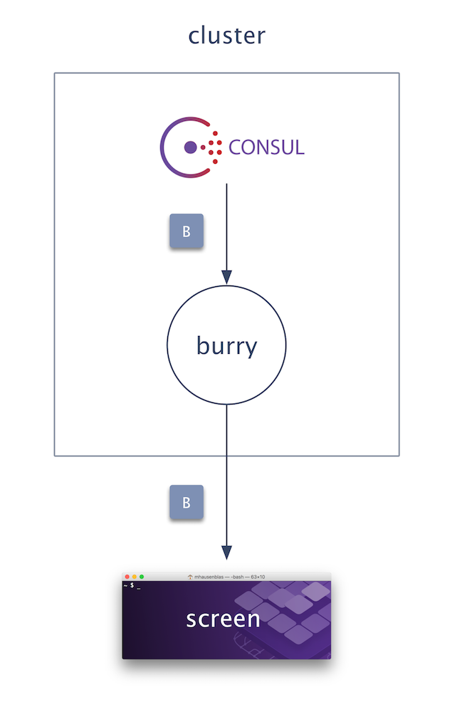
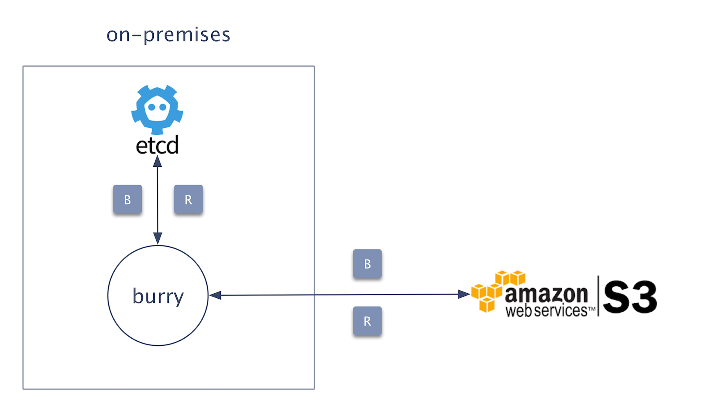
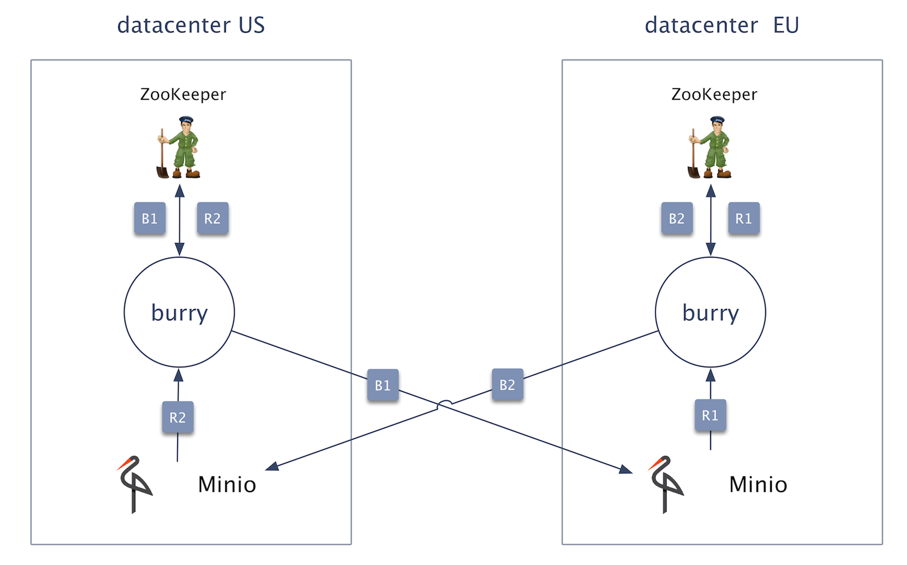

# Background

## Use cases

### UC1: Debugging

You can use `burry` to debug an infra service:

A concrete example: [screen dump of local ZooKeeper content](../../#screen-dump-of-local-zookeeper-content).

### UC2: Simple standby

You can use  `burry` to back up and restore an on-premises infra service to/from the public cloud:

A concrete example: [Restore Consul from Minio](../../#restore-consul-from-minio).

### UC3: Cross-cluster failover

You can use `burry` to perform cross-cluster failover:

- Let's assume the cluster in `datacenter US` is the primary, active one.
- [B1] You perform regular backups of ZK to Minio running in `datacenter EU`
- [R1] If ZK in `datacenter US` fails, you failover to `datacenter EU` and restore the state from Minio there.
- [B2/R2] Same in the other direction.

## Design considerations

### Design goals

Safe and usable. Only non-existing nodes or keys will be restored, that is, no existing data in ZK or etcd will be overwritten when attempting to restore data.

### Assumptions

`burry` assumes that the infra service it operates on is tree-like. 

### Backup algorithm

The essence of `burry`'s backup algorithm is:

- Walk the tree from the root
- For every non-leaf node: process its children
- For every leaf node, store the content (that is, the node value) 
- Depending on the storage target selected, create archive incl. metadata

### Restore algorithm

TBD.